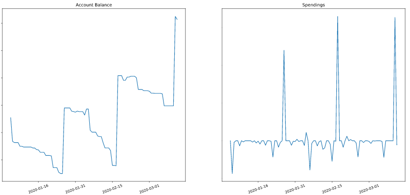
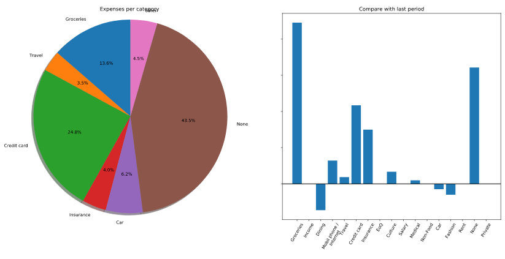
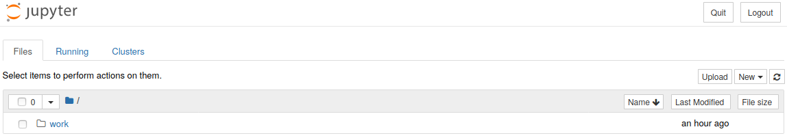
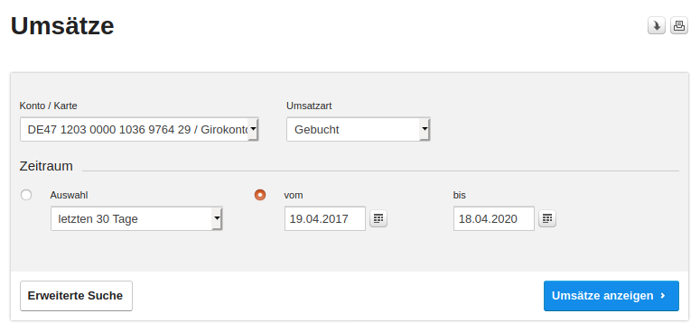
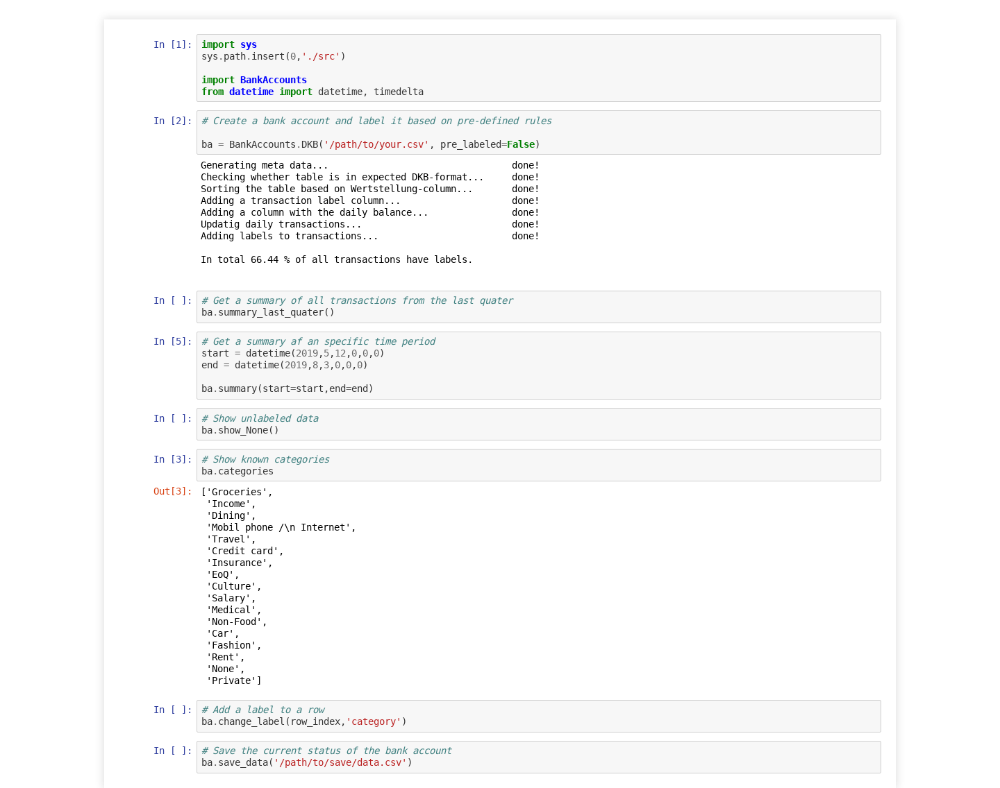

# DKB bank account parser

This project allows you to analyze your monthly (or any other period) changes in your DKB (Deutsche Kreditbank) bank account.




### Prerequisites

This project offers multiple ways of getting the code running. Depending on your operating system and preinstalled software, you might want to choose which approach works best for you.

#### Docker

If you decide to use Docker for this program to run and have not yet installed it, please follow these steps:

##### Ubuntu

To get Docker running on a Ubuntu machine, the following commands should do the trick. I've tested it for Ubuntu 18.04.

```
sudo apt-get update
sudo apt-get remove docker docker-engine docker.io
sudo apt install docker.io
sudo systemctl start docker
sudo systemctl enable docker
```

Please find more information about the installation here: [How to install Docker on ubuntu 18.04](https://phoenixnap.com/kb/how-to-install-docker-on-ubuntu-18-04)

##### Other OS

Please follow the official installation guide for your operating system (Win/macOS) from the official docker website: [here](https://www.docker.com/products/docker-desktop)


#### Jupyter

If you want to use your local python installation together with Jupyter notebooks, this is also fine. Make sure to have at least `python3.6` installed on your machine. Otherwise, you might encounter some errors.

##### Installation with pip

You can install Jupyter with the following command:

```
pip install JupyterLab
```

If you're having `pip3` installed instead of `pip`, alter the above command accordingly.

##### Installation without pip

If you prefer a GUI-based installation, the easiest way to get Jupyter, is by installing the Anaconda environment from their official website: [here](https://www.anaconda.com/distribution/#download-section). Please make sure to select the correct OS.

### Installing

#### Docker 
With this git repo comes a file called `Dockerfile`. If you Docker installed on your machine, this should be the easiest way. If you're missing `docker` and want to fix it, please check out the right section above.

Just run the following command inside this repository:

```
sudo docker build . --tag dkb_parser:1.0
```

If your not on a Unix-based OS, you may have to remove the `sudo` prefix.

Once this build command is finished, which may take a few minutes, you can now start a local Jupyter server. This server contains the latest version of the code and comes with all necessary dependencies.

You can run this docker container (and by that the jupyter server) via:

```
sudo docker run -p 8888:8888 dkb_parser:1.0
```
Once the server is running, you should see something similar like:

```
Set username to: jovyan
usermod: no changes
Executing the command: jupyter notebook
[I 09:30:37.171 NotebookApp] Writing notebook server cookie secret to /home/jovyan/.local/share/jupyter/runtime/notebook_cookie_secret
[I 09:30:37.922 NotebookApp] JupyterLab extension loaded from /opt/conda/lib/python3.7/site-packages/jupyterlab
[I 09:30:37.922 NotebookApp] JupyterLab application directory is /opt/conda/share/jupyter/lab
[I 09:30:37.926 NotebookApp] Serving notebooks from local directory: /home/jovyan
[I 09:30:37.926 NotebookApp] The Jupyter Notebook is running at:
[I 09:30:37.926 NotebookApp] http://fe8728e7a1ed:8888/?token=1374784f2754634113c0cce106a8296fccb1036b8a44d0e1
[I 09:30:37.927 NotebookApp]  or http://127.0.0.1:8888/?token=1374784f2754634113c0cce106a8296fccb1036b8a44d0e1
[I 09:30:37.927 NotebookApp] Use Control-C to stop this server and shut down all kernels (twice to skip confirmation).
[C 09:30:37.932 NotebookApp] 
    
    To access the notebook, open this file in a browser:
        file:///home/jovyan/.local/share/jupyter/runtime/nbserver-18-open.html
    Or copy and paste one of these URLs:
        http://fe8728e7a1ed:8888/?token=1374784f2754634113c0cce106a8296fccb1036b8a44d0e1
     or http://127.0.0.1:8888/?token=1374784f2754634113c0cce106a8296fccb1036b8a44d0e1
```

Follow the instructions and paste one of these URLs into your web browser or `ctrl + click` them.

You should see the Jupyter environment, as shown below:



### Coding style

This project was implemented using `python3.7` and follows `Google's Style` for documentation.

### Usage

To use this tool, we have to feed it with some data. Therefore, you can download all transactions of the last three years from the DKB website. Navigate to Umsätze, choose the period, and export the csv-file by clicking the downfacing arrow in the top right corner like in the image below.



#### Docker

Run the docker run command `sudo docker run -p 8888:8888 dkb_parser:1.0` again. After you've open the link, navigate to `/work/DKB-bank-account-parser`, then press the Upload button in the top right corner, select the previously downloaded csv-file.

**Note:** The server is running on your local machine. Thus your file is _uploaded_ via an intra-machine network from your OS to the docker image, so it never leaves your device.

Afterward, open the file: `DKB.ipynb` and replace the string `/path/to/your.csv` with the actual path to the previously downloaded csv file. Then execute the lines to get a feel for the capabilities of this tool.

#### Jupyter

When using Jupyter, all you need to do is to launch a Jupyter notebook and navigate to this git repository, then open the `DKB.ipynb` and replace the string `/path/to/your.csv` with the actual location of the previously downloaded csv file. Afterward, you can execute the lines line by line to get a feel for the capabilities of this tool and to analyze your data.




## Authors

* **Luis Luettgens** - *Initial work*
## License

This project is licensed under the MIT License - see the [LICENSE](LICENSE) file for details
